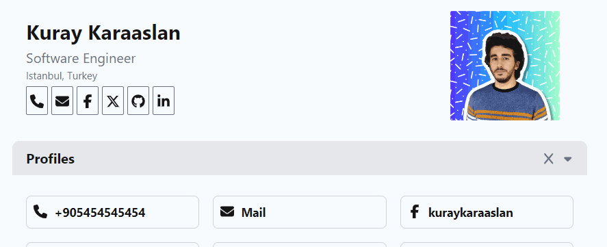

# Print-friendly Resume App



## Overview

This is a print-friendly resume app built using React and Next.js. It allows users to create a professional-looking resume easily. The app provides a clean and organized layout suitable for printing.

## Demo

Check out the [Demo](https://resume.kuray.dev/) to explore the features and functionalities.


## Features

- **Responsive Design:** Ensures a seamless experience across various devices.
- **Print-Friendly:** Designed with printing in mind, allowing users to easily print their resumes.
- **Dynamic Content:** Easily update your resume information through a user-friendly interface.
- **Technologically Diverse:** Developed using React and Next.js for a modern and efficient web application.
- **One File Config** Editing resume.json file will update the resume.
- **Blocks Robots** It disallow the search bots
- **Avoids Page Breaks** Auto A4 Page fitting
- **Auto hide for print mode** Interactive Buttons will be hided

## Sections
- **Basic Infos**
- **Profiles**
- **About Me**
- **Experiences**
- **Skills**
- **Education**
- **Certifications**
- **Languages**
- **Integrations**

## Integrations 

- [Github](https://github.com/)
- [CodeAcademy](https://www.codecademy.com/)
- [HackerRank](https://www.hackerrank.com/)
- [StackOverflow](https://stackoverflow.com/)


## Installation

### Use the Template

1. Click on the `Use this template` button to create a new repository.
2. Clone the repository to your local machine.

### Clone the Repository

1. Clone the repository to your local machine.

```bash
git clone https://github.com/[your-username]/Resume.git
```

2. Navigate to the project directory.

```bash
cd Resume
```

3. Install the dependencies.

```bash
npm install
```

4. Edit the `resume.json` file to update your resume information.

5. Run the development server.

```bash
npm run dev
```

6. Open [http://localhost:3000](http://localhost:3000) in your browser to view the app.

## Deployment

### Vercel

 [How to deploy a Next.js app on Vercel](https://nextjs.org/docs/deployment)


### Netlify

 [How to deploy a Next.js app on Netlify](https://docs.netlify.com/site-deploys/overview/)

### Github Pages

 [How to deploy a Next.js app on Github Pages](https://dev.to/rolanddoda/deploy-to-github-pages-like-a-pro-with-github-actions-4hdg)

## License

This project is open source and available under the [MIT License](LICENSE).

## Acknowledgements

- [Next.js](https://nextjs.org/)
- [React](https://reactjs.org/)
- [Tailwind CSS](https://tailwindcss.com/)

## Support

If you have any questions or need help with using the project, feel free to reach out to me at [kuray.dev](https://kuray.dev/).

## Author

- [Kuray Karaaslan](https://kuray.dev/)


